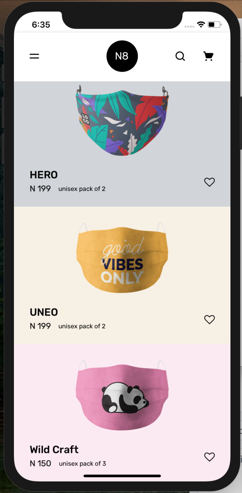
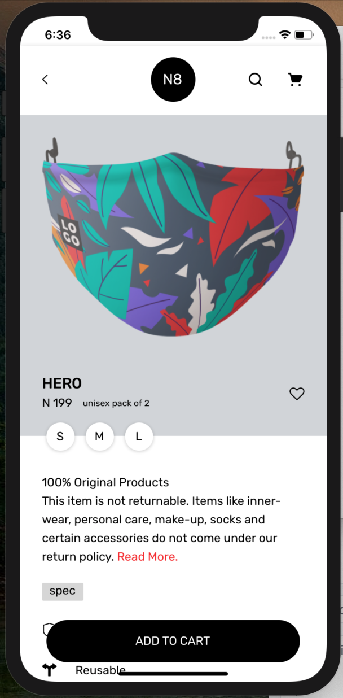

# tarvos-Test

## Preview

<span>
 
 
 
 
 
</span>

## Follow this [link](https://drive.google.com/file/d/15HRXzjlQTJSKlOafXQuM1ZjkybwcnhNz/view?usp=sharing) To preview the video demo of the app

## Getting Started

1. Fork or Clone the repo, then set it up:

```
$ cd tarvos-Test
$ yarn install
```

### Run on Android

```
$ npx react-native run-android
```

### Run on iOS

```
$ cd ios && pod install
$ cd .. && npx react-native run-ios
```
